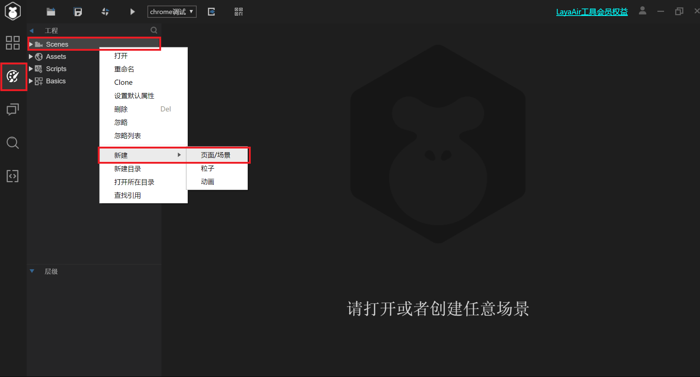
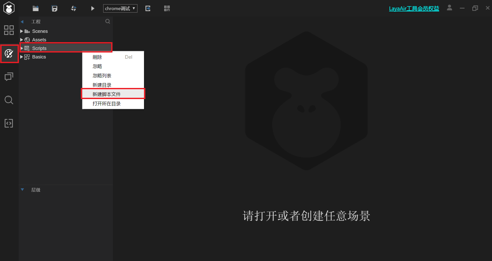
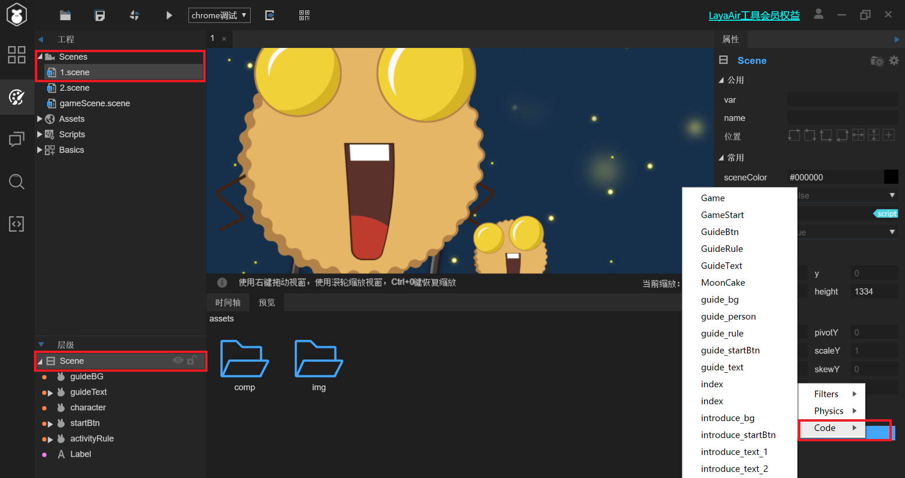

# 淘宝小程序游戏迁移Laya引擎

 ## 1. 目录结构
+ bin —— 当前项目的输出文件
+ laya —— 存放UI项目
    + assets —— 图片，音频资源目录
    + pages —— .scene 场景文件 key-value 格式
+ libs —— 项目库目录
+ release —— 发布目录
+ src —— 源代码目录
    + Main.ts —— 项目入口
    + GameConfig.ts —— 引擎配置
    + script —— 游戏控制脚本目录
***
## 2. 接入淘宝小程序
[淘宝官方文档：接入LayaAir引擎](https://miniapp.open.taobao.com/docV3.htm?docId=119179&docType=1&qq-pf-to=pcqq.c2c&tag=dev)

步骤：
> 1. 下载LayaAir IDE：https://ldc2.layabox.com/layadownload/?type=layaairide-LayaAir
> 2. 发布时选择“淘宝创意互动”
> 3. 用淘宝小程序IDE打开


***
## 3. 分步分解开发流程

[官方文档](https://ldc2.layabox.com/)

### 3.1 Laya引擎运行过程
> 1. 项目入口Main.ts，初始化引擎
> 2. 加载scene
> 3. 生成节点树
> 4. 实例化节点组件，挂载脚本
> 5. 调用各种脚本方法

### 3.2 开发流程
> 1. 配置引擎
> 2. 新建场景
> 3. 往场景中添加节点
> 4. 新建控制脚本
> 5. 节点挂载控制脚本

### 3.3 新建场景的方式
> 1. 用IDE的方式  
> 点击编辑模式 => 右键点击Scenes => 新建 => 页面/场景  
> 
> 2. 代码方式  
> a：在laya/pages目录下，编写.scene文件  
> b：参考API文档 Laya.display.Scene，在Main.ts中加入Scene类实例  

### 3.4 添加节点
> 1. 用IDE的方式  
> 进入编辑模式，直接将左侧的节点模板拖入scene中，这种方式适合添加静态节点，添加的节点会写在laya/pages目录下，你添加节点的那个scene文件里面
> 2. 代码方式  
> a：在控制脚本中,用addChild( )添加  
> `Laya.stage.addChild(new Laya.Sprite());`  
> b：在laya/pages目录下，对应scene文件下，手动写配置

### 3.5 新建控制脚本
> 1. 用IDE的方式  
> 点击编辑模式 => 右键点击Scripts => 新建脚本文件  
> 
> 2. 代码方式  
> 新建一个脚本文件，继承Laya.Script类  
> 在GameConfig.ts中注册这个脚本类  


```typescript
// GameControl.ts

export default class GameControl extends Laya.Script {
  constructor() {
    super();
  }
  // 初始化的时候执行，仅执行一次
  onAwake(): void {}
  onEnable(): void {}
  onDisable(): void {}
}

// GameConfig.ts

export default class GameConfig{
    static width:number=750;
    static height:number=1334;
    static scaleMode:string="fixedauto";
    static screenMode:string="none";
    static alignV:string="top";
    static alignH:string="left";
    static startScene:any="1.scene";
    static sceneRoot:string="";
    static debug:boolean=false;
    static stat:boolean=false;
    static physicsDebug:boolean=false;
    static exportSceneToJson:boolean=true;
    constructor(){}
    static init(){
        var reg: Function = Laya.ClassUtils.regClass;
        // 在这里注册
        reg("script/GameControl.ts",GameControl);
    }
}
GameConfig.init();
```
### 3.6 节点挂载控制脚本
> 1. IDE方式  
> 选择一个场景 => 左下角点层级 => 选择需要添加脚本的节点 => 右下角点添加 => code
> 
> 2. 代码方式  
> ```typescript
> this.owner.addChild(new Script());
> ```

### 3.7 对于节点树的操作
> 对于某个被挂载的脚本来说 `this.owener` 就是它所挂载节点  
> `this.owener.scene` 就是这个节点所在的场景  
> `this.owener.perant` 节点的父节点  
> `this.owener.scene.getChildByName()` 取该节点所在场景的某个子节点
> `this.owener.scene.getChildren()` 该节点所在场景的所有子节点，返回数组
